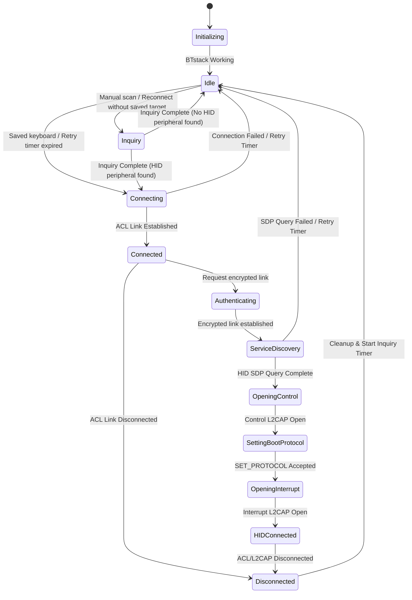

# Pico W Bluetooth Keyboard Adapter

Pico W firmware that exposes a TinyUSB composite USB device containing a
boot-protocol HID keyboard and a USB CDC serial port. It discovers a Bluetooth
Classic keyboard, opens its HID Control and Interrupt channels, requests Boot
Protocol, and forwards eight-byte boot-keyboard input reports to USB. Wi-Fi is
enabled as a password-protected configuration access point.

## Build

```bash
cmake -S . -B build -DPICO_SDK_PATH="$PICO_SDK_PATH" -DPICO_BOARD=pico_w
cmake --build build
```

The resulting firmware is `build/pico_bt_keyboard.uf2`.

## Hardware smoke test

On a Linux USB host, `tools/smoke_test.py` records the CDC log and USB keyboard
input events together. It automatically creates timestamped logs and reports
whether connect, input, disconnect, and reconnect were observed. See
[`tools/README.md`](tools/README.md) for setup and execution instructions.

## Configuration HTTP API

The firmware starts a WPA2 configuration access point alongside Bluetooth:

- SSID: `PicoW-Keyboard-Setup`
- Password: `pico-keyboard`
- URL: `http://192.168.4.1`

The built-in DHCP server assigns the connecting PC or phone an address. The
current API endpoints are:

```text
GET  /api/status
POST /api/scan
POST /api/connect?address=XX:XX:XX:XX:XX:XX
POST /api/disconnect
POST /api/reconnect
POST /api/forget
```

For example:

```bash
curl http://192.168.4.1/api/status
curl -X POST http://192.168.4.1/api/scan
curl -X POST 'http://192.168.4.1/api/connect?address=XX:XX:XX:XX:XX:XX'
```

Action endpoints return HTTP `202` after the request is queued. Poll
`/api/status` to observe the resulting asynchronous state change. The browser
UI at `/` provides the same status, scan, connect, disconnect, reconnect, and
forget operations without requiring a CDC terminal.

During legacy PIN pairing, the UI displays `0000` for 30 seconds. Type those
digits on the Bluetooth keyboard and press Enter. The prompt disappears when
authentication finishes, fails, disconnects, or times out.

## Host tests

Boot keyboard report validation, device selection, connection-state
transitions, HID channel state, and bounded SDP attribute parsing can be tested
without a Pico SDK toolchain:

```bash
cmake -S tests -B build-host-tests
cmake --build build-host-tests
ctest --test-dir build-host-tests --output-on-failure
```

## Run on Pico W

1. Hold **BOOTSEL** while connecting the Pico W to the computer over USB.
2. Copy `build/pico_bt_keyboard.uf2` to the mounted `RPI-RP2` drive.
3. The Pico W reboots and enumerates as **Pico W USB HID Keyboard** plus a USB
   serial (CDC) port.
4. A saved keyboard is discovered and reconnected automatically. Open the CDC
   serial port only when logs or text commands are needed.

The fixed USB typing demo is disabled by default. Enable it only for USB API
development with `-DPICO_KEYBOARD_DEMO=ON` when configuring CMake.

Typical console output is:

```text
[BT] Stack started; adapter address XX:XX:XX:XX:XX:XX
[BT] Inquiry started
[BT] Device: XX:XX:XX:XX:XX:XX RSSI=-42 CoD=0x002540 Name=Keyboard
[BT] Inquiry complete
Scan complete
```

## USB keyboard API

`keyboard_press(uint8_t modifier, uint8_t keycode)` sends a key-down report.
`keyboard_release()` sends the all-keys-released report.
`keyboard_type(uint8_t modifier, uint8_t keycode)` presses, waits 10 ms, and
releases. `keyboard_demo_task()` is kept in `usb/` and only validates this API.

Bluetooth Boot Keyboard reports are forwarded as complete modifier plus six-key
USB reports. USB keyboard LED state is returned over the Bluetooth HID Control
channel as a Boot Output Report. BTstack and lwIP are driven cooperatively by
`bluetooth_task()` through the Pico W asynchronous poll context. Generic HID Report Protocol descriptors are not parsed;
the current implementation intentionally supports Boot Protocol keyboards.

## Bluetooth module

The Bluetooth module manages Bluetooth Classic operations using BTstack.

### Components

- **`bt/bluetooth.c`**: Initializes BTstack, registers the HCI event handler, and manages the lifecycle of Bluetooth operations. Once the stack is ready, it searches for a saved keyboard without depending on the USB CDC connection and logs available diagnostics there.
- **`bt/bt_state.c`**: Defines connection states, names, and allowed transitions.
- **`bt/control_command.c` / `bt/control_request_queue.c`**: Parse CDC commands
  and queue connection-management requests for execution in the cooperative
  Bluetooth task context.
- **`bt/hid_boot_report.c`**: Validates and parses HIDP Boot Keyboard input and builds LED output packets without depending on BTstack runtime state.
- **`bt/hid_channels.c`**: Owns HID Control/Interrupt CIDs, channel-open state, Boot Protocol scheduling state, and reconnect-safe LED state.
- **`bt/sdp_parser.c`**: Reassembles SDP attribute chunks and extracts HID Control/Interrupt PSMs and service metadata.
- **`bt/device_manager.c` / `bt/device_manager.h`**: Manages a list of up to 16 discovered devices in memory.
  - **`Device` struct**: Keeps track of the device's state including:
    - Bluetooth Address (`BD_ADDR`)
    - Device Name
    - RSSI
    - Class of Device (CoD)
    - Connected flag (`connected`, reserved for future use)
    - HID supported flag (`hid_supported`, reserved for future use)
  - **`DeviceManager` struct**: Keeps an array of discovered devices and handles updates/insertions (`device_manager_upsert`).
- **`bt/btstack_config.h`**: Configuration definitions for BTstack.

### State Machine

The Bluetooth module operates as a finite state machine to manage scan intervals, connection, and SDP service discovery lifecycles:



- **`Initializing`**: BTstack is powering up and registering packet handlers.
- **`Idle`**: The stack is ready. With automatic reconnection enabled and a saved keyboard present, it retries a direct ACL connection every 5 seconds. Direct paging works even when a paired keyboard is no longer discoverable.
- **`Inquiry`**: Performs a 5-second Bluetooth Classic Inquiry scan. No scan is started or scheduled while connected or connecting.
- **`Connecting`**: Initiates a Classic ACL connection to the target device.
- **`Connected`**: An ACL link is active.
- **`Authenticating`**: Requests authentication and encryption before starting
  SDP. This also allows a previously stored Classic link key to be reused.
- **`ServiceDiscovery`**: Auto-triggers SDP Client query to search for the Human Interface Device (HID) service, retrieving Control PSM, Interrupt PSM, Service Name, and Provider Name.
- **`HIDConnected`**: Both HID L2CAP channels are open and Boot Keyboard input reports are forwarded to USB.
- **`Disconnected`**: The ACL link is disconnected. Prepares resources for teardown before returning to `Idle`.

### Implementation Status

Current implementation:
1. **Device Discovery**: The Pico W performs a 5-second Classic Inquiry scan. Discovery events are logged as `[BT] Event: GAP_EVENT_INQUIRY_RESULT` and newly found devices are printed as `[BT] Found: ...`. Duplicate log prints for the same device during a single scan are suppressed.
2. **Device Selection**: `DeviceManager` filters Keyboard/Peripheral devices by Class of Device (`0x0500` with minor class `0x40` set). A keyboard with a persisted link key is preferred; otherwise the first discovered keyboard is selected.
3. **Bluetooth Classic Connection**: The module initiates an ACL connection. Once established, it transitions to `Connected`. If it fails or disconnects, it transitions back to `Idle` via a 5-second wait timer.
4. **SDP Service Discovery**: Once authenticated and encrypted, an SDP search (`BLUETOOTH_SERVICE_CLASS_HUMAN_INTERFACE_DEVICE_SERVICE`) automatically retrieves the Control PSM, Interrupt PSM, Service Name, and Provider Name, storing them in `DeviceManager` before opening the HID channels. The bounded parser handles nested SDP Data Elements and malformed lengths. If a keyboard omits usable protocol descriptors, the implementation falls back to the Bluetooth HID standard PSMs (`0x11` and `0x13`) and reports that choice on CDC.
5. **Boot HID transport**: Opens Control and Interrupt L2CAP channels, selects Boot Protocol, receives keyboard input reports, and queues complete USB keyboard states. Disconnects force an all-keys-released USB report before reconnecting.

Legacy pairing currently uses PIN `0000`. SSP uses the no-input/no-output mode,
and Classic link-key requests are answered explicitly from the Pico SDK's
TLV-backed persistent database. Generic Report Protocol keyboards are not yet
supported.

When multiple keyboards are discovered, a keyboard with a link key in the
persistent bond database is selected before an unpaired keyboard. The CDC
console accepts the following commands:

- `help` — list available commands.
- `status` — display state, selected address, and discovered devices.
- `scan` — scan without automatically connecting; this requires the Idle state.
- `connect XX:XX:XX:XX:XX:XX` — select, persist, and connect to a keyboard from
  the most recent scan.
- `disconnect` — disconnect and suspend automatic reconnection.
- `reconnect` — resume automatic reconnection to the selected keyboard.
- `forget` — delete the selected address and all stored Classic link keys.

The selected keyboard address uses the same flash-backed BTstack TLV store as
the Classic link-key database and is restored after reboot. `forget` requires
pairing again on the next connection.

`include/bluetooth_control.h` is the presentation-independent interface used by
CDC and the planned HTTP API. It accepts queued actions and returns a copied
snapshot containing connection state, the selected address, and discovered
devices; UI code does not access BTstack or `DeviceManager` directly.

If a saved Classic link key is rejected and the controller requests a PIN
again, the stale key is deleted before pairing. A newly generated key is
explicitly written to the TLV database and read back immediately; the CDC log
reports `Link key persisted ... verified=1` without exposing key material.

### Remaining Segmentation

State definitions, SDP attributes, Boot Reports, and HID channel state are now
separate modules. The remaining `bt/bluetooth.c` work is primarily BTstack
event dispatch and the Inquiry/ACL lifecycle.

## Planned layout

- `bt/` — Bluetooth host integration (BTstack)
- `usb/` — USB HID device integration (TinyUSB)
- `web/` — configuration UI
- `storage/` — persisted settings and pairing data
- `include/` — project headers
